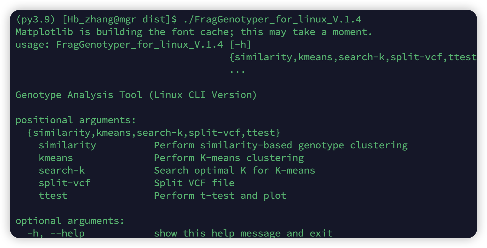
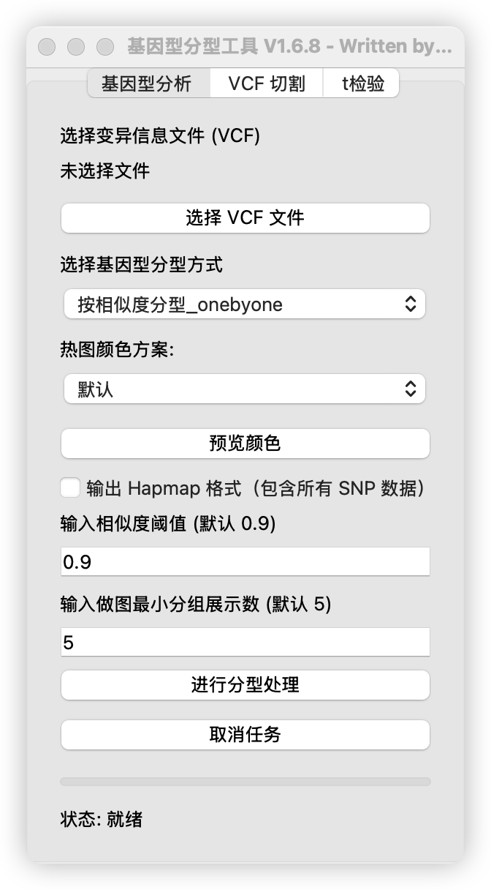
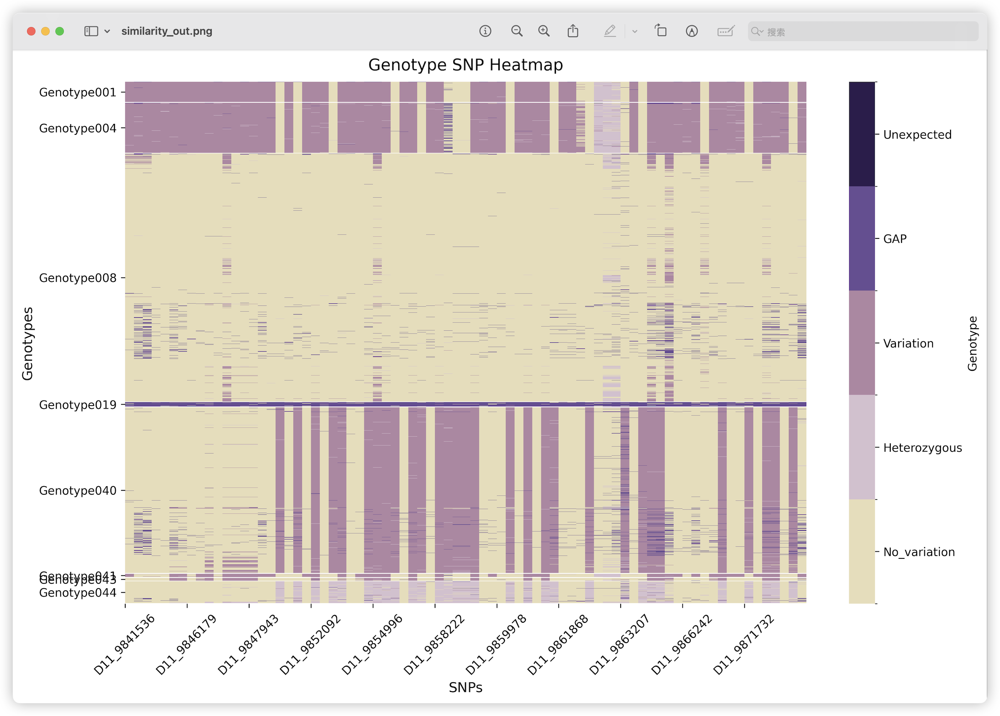
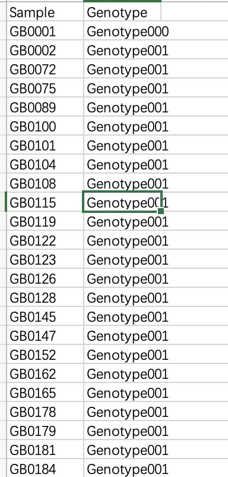

# FragGenotyper README

code by zhanghaobo

written in 2024.11

Please send me an email if you have any questions
hbzhang1999@gmail.com

FragGenotyoer The data can be typed and classified according to the fragment SNP. The software is a cross-platform "low" resolution genotyping software written in python.


## Installation instructions


Compile-free software for the whole package. To facilitate the use of undeployed digital signatures.


#### MAC (M chip version) version

After downloading, open the App Store and approved developers in System Settings/Privacy & Security/Security.

Double-click the downloaded software (some versions of MAC may need to be opened under System Settings/Privacy & Security/Security.)


#### linux version

After the download is complete,./FragGenotyper_for_linux_V.x.x [argements] can be run. The following figure shows the normal running state



## Main parameter description

### Mac version

Data required: VCF file

The MAC version currently has two major modules


#### VCF file cutting (SNP extraction module) :

SNPS can be extracted according to their distribution position, material and other factors, but it is recommended to only perform lightweight quantification work or verify the extraction of subgroup genotypes


#### T-test

Phenotypic and genotypic data were combined for t-test prior to genotype

note: Phenotypes are denoted with csv beginning with "Genotype,Phenotype";

​	 Genotype files can be output files of genotyping results (some noise genotypes can be removed)


#### Genotyping module

Two algorithms are provided


##### Similarity typing method

The algorithm uses global comparison of the similarity between the materials (the SNPS are compared one by one), and then classifies the materials according to the similarity degree

It is necessary to provide the maximum degree of error allowed for a genotype, and the minimum number of genotype displayed material at the time of drawing


##### Hierarchical clustering genotyping method

In the way of unsupervised machine learning, the algorithm uses search_for_k to roughly determine the number of a genotype, and then we manually judge and verify the k value for artificial hierarchical clustering.

The graphical interface of

###  mac version is shown




### linux version

Provide the analyze, kmeans, search_for_k parameters.

#### Similarity typing method (analyze parameters)

A similarity matrix was constructed for SNPS, and a topological matrix between materials was constructed according to the similarity. It is a more common method for genotyping. If the onebyone parameter is used, it is time-consuming to compare the materials in pairs.

```sh
[similarity]
usage: FragGenotyper_for_linux_V.1.4 similarity [-h] --vcf VCF --output-csv
                                                OUTPUT_CSV --output-heatmap
                                                OUTPUT_HEATMAP
                                                [--threshold THRESHOLD]
                                                [--show-num SHOW_NUM]
                                                [--hapmap]
                                                [--color-scheme {default,gradient,soft,vivid}]
                                                [--onebyone]

optional arguments:
  -h, --help            show this help message and exit
  --vcf VCF             Input VCF file
  --output-csv OUTPUT_CSV
                        Output CSV file
  --output-heatmap OUTPUT_HEATMAP
                        Output heatmap PNG file
  --threshold THRESHOLD
                        Similarity threshold (default: 0.9)
  --show-num SHOW_NUM   Minimum group size for display (default: 5)
  --hapmap              Output in Hapmap format
  --color-scheme {default,gradient,soft,vivid}
                        Color scheme
  --onebyone            Use one-by-one clustering
```


#### Hierarchical clustering genotyping method (kmeans, search_for_k parameters)

The genotypes were classified by hierarchical clustering tree construction

The parameter of search_for_k suggests the number of subtypes to be genotyped.

```sh
[search-k]
usage: FragGenotyper_for_linux_V.1.4 search-k [-h] --vcf VCF --output-sse
                                              OUTPUT_SSE

optional arguments:
  -h, --help            show this help message and exit
  --vcf VCF             Input VCF file
  --output-sse OUTPUT_SSE
                        Output SSE plot PNG file
                        
[kmeans]
usage: FragGenotyper_for_linux_V.1.4 kmeans [-h] --vcf VCF --output-csv
                                            OUTPUT_CSV --output-heatmap
                                            OUTPUT_HEATMAP --output-tree
                                            OUTPUT_TREE [--k K]
                                            [--color-scheme {default,gradient,soft,vivid}]

optional arguments:
  -h, --help            show this help message and exit
  --vcf VCF             Input VCF file
  --output-csv OUTPUT_CSV
                        Output CSV file
  --output-heatmap OUTPUT_HEATMAP
                        Output heatmap PNG file
  --output-tree OUTPUT_TREE
                        Output tree file (.tre)
  --k K                 Number of clusters (default: 2)
  --color-scheme {default,gradient,soft,vivid}
                        Color scheme
```


## Presentation of results

Heat map of typing results (.png)




Results of typing data (.csv)



SSE line chart (.png); Tre file (.tre)
